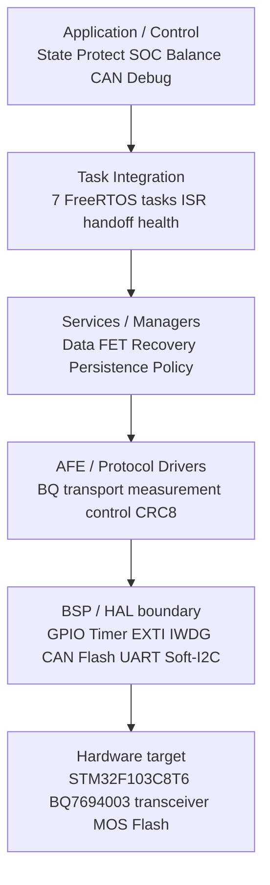
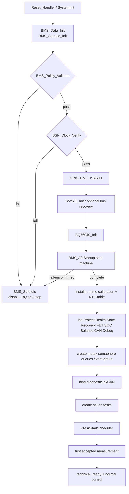
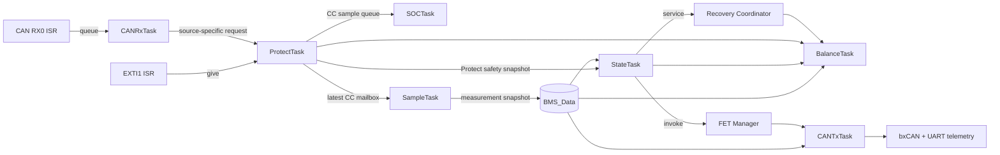
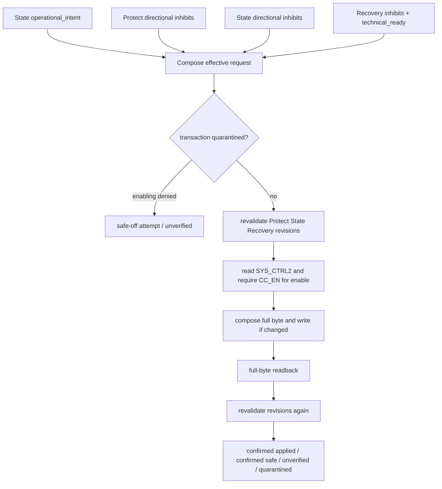

# BMS V1 软件架构总览

文档状态：Engineering Closure M3；软件/仿真 release candidate 架构说明。

## 1. 项目定位与证据边界

BMS V1 是一个面向大学生嵌入式软件工程实践的 13S NMC BMS 学习项目。目标 MCU 是 `STM32F103C8T6`，AFE 是 `BQ7694003`，RTOS 是 FreeRTOS V11.1.0，生产 target 使用 Keil MDK5 / ARMCC5 5.06u7。

当前结论是“software / simulation release candidate”，不是量产软件、硬件认证或实车验证。Keil Simulator、production-C tests、静态 verifier 与 ARMCC5 target build 可以证明源码集成、确定性行为、race guard 和资源布局；不能证明 I2C/ALERT 电气波形、真实测量精度、MOS 导通、CAN 收发器、brownout、热、EMI/ESD。

当前开发参数来自 `SIM-HW-POLICY-V1` / `SIM_POLICY_V1`。真实 BOM/板级参数到位后，应替换配置并执行 REAL_HW validation，不重写冻结的 writer/ownership 架构。

## 2. 分层架构



关键边界：

- Driver 不决定产品策略；例如 `bq76940_control.c` 只编码 threshold/register，不决定阈值。
- `BMS_Data` 是 coherent data 与 diagnostic aggregation 服务，不是 FET safety authority。
- Task context 与 writer module 分开表述：StateTask 是 FET Manager 的执行上下文，真正的 SYS_CTRL2 writer 是 `bms_fet_manager.c`。
- ISR 只完成硬件 pending/FIFO 到 RTOS 对象的交接；业务解析、I2C 和安全动作留在 task。

## 3. 启动序列与 fail-safe

入口是 `firmware/User/main.c`：



`BMS_AfeStartup` 在 scheduler 之前逐步执行，先让 CHG/DSG 与 CELLBAL 全部处于可读回的安全状态，再配置 ADC、CC 与 protection registers，读取实际 calibration，等待 800 ms，检查 SYS_STAT。startup 的唯一 W1C 权限是当次 final-status 明确观察到的 XREADY；clear 后必须重新走完整配置与 settle，不能复用 clear 前证据。

任何 policy、clock、I2C、BQ、startup calibration、safe-off readback、RTOS object/task creation 失败都会进入 `BMS_SafeIdle()`。这里的软件行为是“停止继续运行”；没有真实硬件证据时，不把它表述为“物理 MOS 已关断”。

## 4. 七任务架构

| Task | Priority / trigger | Inputs | Outputs / owned state | Heartbeat | Shared-state dependency |
|---|---|---|---|---|---|
| Protect | 5；ALERT semaphore、stuck-level retry；最大健康 wait 100 ms | PB1/EXTI、SYS_STAT、CC、recovery/reset requests | Protect fault/action snapshot、source generation、XREADY generation/W1C ack、CC queue/mailbox | `PROTECT` | bounded `xI2CMutex`; gives urgent State notification |
| Sample | 4；250 ms periodic | BQ cell/BAT/TS1、Protect latest CC、calibration provenance | measurement frame、`sample_sequence`、`afe_generation`、sample diagnostics | `SAMPLE` | bounded `xI2CMutex`; publishes under `xDataMutex` after release |
| State | 3；100 ms timeout或 urgent notification | Data snapshot、Protect snapshot、Recovery、heartbeats | State/SW safety snapshot、HW recovery request、diagnostic aggregate；执行 Recovery 与 FET Manager；sole IWDG feed | `STATE` | no nested data/I2C lock；compare-and-publish |
| SOC | 3；1000 ms periodic | CC queue、measurement、restore payload | SOC/capacity snapshot、BMS_Data SOC diagnostic、A/B save request | `SOC` | sole consumer of `xCcSampleQueue`; sole persistence save caller |
| Balance | 2；1000 ms periodic | measurement、State/Protect/Recovery snapshots | requested/confirmed CELLBAL snapshot；sole scheduler-era CELLBAL writes | `BALANCE` | bounded `xI2CMutex`; revision recheck |
| CANTx | 2；10 ms service loop；100 ms frame publication；1 s UART snapshot / 8 B bounded drain | data/safety/FET/recovery/SOC/balance diagnostics、TX queue | sole bxCAN transmit path、CAN diagnostics、read-only UART telemetry | `CAN_TX` | owns hardware TX drain; no safety authority |
| CANRx | 2；RX queue，100 ms bounded wait | frames copied by FIFO0 ISR | validated source-specific service-reset request | `CAN_RX` | no direct hardware/safety write |

FreeRTOS objects：2 mutex (`xI2CMutex`, `xDataMutex`)、1 binary semaphore (`xAfeAlertSem`)、3 queues (`xCanTxQueue`, `xCanRxQueue`, `xCcSampleQueue`)、1 event group (`xSysEvents`) 与 1 direct notification path（Protect/Recovery 唤醒 State）。事件组主要保留集成/诊断事件，不承担 FET authority。



## 5. Measurement data flow

```text
BQ VC/BAT/TS1 registers + Protect latest CC mailbox
  -> BQ76940_Read* / integer conversions
  -> Sample local staging frame
  -> calibration/XREADY/config revision recheck
  -> BMS_Data_PublishMeasurement()
  -> sample_sequence advances; afe_generation copied
  -> State / SOC / Balance / CAN / Debug / Recovery consumers
```

四个常被混淆的概念：

- validity：交易和换算是否成功，字段是否有合法来源；invalid 不是 stale。
- in-range：数值是否落在软件模型允许范围；valid 也可能 out-of-range。
- freshness：`now_ms - timestamp_ms` 是否小于各组上限；cell/current 1000 ms，temperature 5000 ms。
- identity：`sample_sequence + afe_generation`；sequence 标识已接受 publication，generation 标识它属于哪个 AFE/XREADY epoch。

Sample 先在本地完成 13-cell core 与可选 current/temperature group，mandatory core 失败时不发布 partial frame。I2C lock 与 data lock 不嵌套：完成硬件读取并释放 `xI2CMutex` 后，才用 `xDataMutex` 原子提交。State 的决定携带 `evaluated_sample_sequence/evaluated_afe_generation`；提交前通过 `BMS_Data_GetIdentity()` compare-and-publish，若新 sample 已到达则拒绝旧决定并重算。

## 6. Fault 与 directional inhibit 架构

| Owner | Authoritative sources | 主要 action |
|---|---|---|
| ProtectTask | HW_OV/HW_UV/HW_OCD/HW_SCD、AFE_XREADY/OVRD_ALERT/COMM/CRC | source-specific CHG/DSG/BOTH inhibits；private lifecycle/revision/generation |
| StateTask | SW_OV/SW_UV/SW_OC、temperature、DATA_STALE、RTOS_HEALTH | directional inhibits 与 operational classification |
| Recovery Coordinator | recovery technical readiness/in-progress | XREADY recovery 期间 BOTH inhibit |
| BMS_Data | OR 后的 active/latched diagnostic summary | 无 FET authority |

Fault bit 表达“什么 source active/latched”；`inhibit_chg_reasons` 与 `inhibit_dsg_reasons` 表达“这个 source 对哪个方向有权限影响”。FET Manager 不从 fault bitmap 反推 action。任何 active safety source 若没有明确映射，进入 `BMS_INHIBIT_REASON_UNKNOWN_SOURCE`，默认同时 inhibit CHG/DSG。

HW_OV/HW_UV/HW_OCD 的恢复不是看到 SYS_STAT low 就清。State 用新鲜 measurement 按 hysteresis/qualify 构造 request，其中含 fault、request ID、source generation、sample identity、qualification revision、expiry；Protect 再读一次 SYS_STAT 并复核 identity，只清自己拥有的 active source，再发布 ack。

## 7. State 架构：分类不等于权限

`BMS_STATE_INIT/STANDBY/CHARGE/DISCHARGE/FAULT` 是运行分类。State engine 通过 current threshold 与 qualify time 选择分类；存在 fault 时显示 `FAULT`，technical readiness 未建立时显示 `INIT` 或 startup timeout 后 `FAULT`。

State 也产生 `operational_intent`，但这只是 FET decision 的一个输入。不能使用以下简化：

```c
if (state == BMS_STATE_FAULT) {
    /* 并不能替代 authoritative inhibit/revision chain */
}
```

例如 SW_OV 只 inhibit CHG；在没有其他 source 时，DSG 方向仍由它自己的 intent 和 inhibit chain 决定。`FAULT` 作为分类不会覆盖 directional semantics。

## 8. FET decision 与 transaction chain



FET Manager 是 scheduler-era 唯一 SYS_CTRL2 CHG/DSG writer。它保存 requested、effective、observed register bits、inhibit reasons 与 Protect/State/Recovery revisions。enable write finalization ambiguous 或 readback mismatch 会进入 quarantine；不能 blind replay enable，只能尝试 safe-off。`register_state_confirmed` 证明的是 BQ register readback，不是 MOS conduction。

## 9. Runtime XREADY recovery

```mermaid
stateDiagram-v2
    [*] --> IDLE
    IDLE --> PRE_CLEAR_PREPARE: new xready_generation
    COMPLETE --> PRE_CLEAR_PREPARE: new XREADY
    PRE_CLEAR_PREPARE --> PRE_CLEAR_READY: FET register off + balance all-off confirmed
    PRE_CLEAR_READY --> WAIT_CLEAR_ACK: authorize generation/revision; wake Protect
    WAIT_CLEAR_ACK --> POST_CLEAR_CONFIG: Protect W1C ack accepted
    WAIT_CLEAR_ACK --> FAILED: W1C finalization ambiguous
    POST_CLEAR_CONFIG --> POST_CLEAR_SETTLE: full register plan written/read back
    POST_CLEAR_SETTLE --> POST_CLEAR_VERIFY: 800 ms elapsed
    POST_CLEAR_VERIFY --> CALIBRATION_HANDOFF: XREADY/blocking status absent
    CALIBRATION_HANDOFF --> WAIT_FIRST_VALID_SAMPLE: provenance accepted by Sample
    WAIT_FIRST_VALID_SAMPLE --> COMPLETE: first new sequence at current generation + latch release
    PRE_CLEAR_PREPARE --> FAILED: unrecoverable error
    POST_CLEAR_CONFIG --> FAILED: transport/readback error
    POST_CLEAR_VERIFY --> FAILED: status not safe
```



new XREADY 首次 observation 推进 `xready_generation`，旧 recovery/calibration/sample evidence 立即失效。`PRE_CLEAR_PREPARE` 要求 FET readback off、CC_EN 存在且 balance all-off 属于当前 generation；只有 Protect 可以执行 runtime XREADY W1C。clear 后重新应用完整配置、等待、读 calibration、验证 status，再携带 `{xready_generation, recovery_revision, post_clear_verified, calibration}` 交给 Sample。Recovery 只在第一帧 current-generation measurement 被接受且 source-specific latch release 成功后 `technical_ready=true`。

从 observation 到 `COMPLETE`，Recovery snapshot 对 CHG/DSG 都给出 `BMS_INHIBIT_REASON_RECOVERY`。`FAILED` 继续 fail-closed。

## 10. Health 与 IWDG

每个 required task 只递增自己的 aligned `uint32_t generation`，不使用可被 monitor 清零的 heartbeat bit。StateTask 周期性 snapshot counters，比较每个 task 的 last generation/last advance 与 policy liveness window。

```text
7 task-owned generations
  -> StateTask BMS_Health_Evaluate()
  -> all first advances observed
  -> BSP_IWDG_StartNominal(4000 ms)
  -> healthy: StateTask feeds
  -> stale task: RTOS_HEALTH + BOTH inhibit + no feed
  -> target watchdog reset (physical timing requires REAL_HW)
```

Protect/CANRx 等 event-driven tasks 使用 bounded wait，保证它们即使没有外部事件也能证明 liveness。软件配置的 4000 ms 是 nominal；实际 timeout 依赖 LSI，必须实测。

## 11. SOC

`Task_SOC` 是 SOC estimate 的 sole writer，也是 `xCcSampleQueue` 的 sole consumer。Protect 在 CC_READY 交易成功且 sample 进入 queue 后才 W1C；queue full 时保留 newest、丢弃一个 oldest，并置 gap diagnostics。

SOC engine 使用整数 `mA*ms` (`remaining_mams`) 累积，正电流为充电、负电流为放电，应用 995/1000 charge efficiency 与 1000/1000 discharge efficiency。CC sample 绑定 `xready_generation`；generation change 或 queue gap 会使连续积分证据失效并可观测。startup 优先恢复 newest-valid Flash payload，否则根据 fresh cell OCV 与 fallback 初始化。full/empty correction 仅在配置条件持续满足时执行。

## 12. Balance

Balance eligibility 同时要求：State 为 CHARGE/STANDBY、State/Protect 无任一方向 inhibit、Recovery ready、cell/current/temperature valid+fresh、温度/电流/电压在 policy 窗口内。选择器使用 20 mV start/10 mV stop hysteresis、最多 2 cells、禁止相邻、5 s rotation。

`Task_Balance` 是 scheduler-era `CELLBAL1..3` 唯一 writer。写前和写后复核 measurement identity 与 State/Protect/Recovery revisions；发生变化、timeout、transport/readback mismatch 时尝试 all-off 并将 register confirmation 标为 false。startup 的 all-zero readback 是 pre-scheduler 例外。

## 13. CAN：protocol/core 与 target binding

CAN core 以显式 byte encoding 生成 6 个 standard frames `0x180..0x185`；不能 raw-copy C struct。service RX 只接受 exact standard ID `0x280`，校验 magic、command、source、request ID 与 1000 ms freshness，再转换成 Protect source-specific reset request。CAN command 不能直接写 FET、CELLBAL、fault bitmap 或 IWDG。

Target binding 在 `bsp_can.c`：

- PA11 RX / PA12 TX；PCLK1 36 MHz；prescaler 9，1+6+1 tq，500 kbit/s，87.5% sample point；
- FIFO0 exact-ID mask filter；priority 7 RX ISR 循环 drain FIFO，只 copy/enqueue；
- CANTxTask 是唯一 `BSP_CAN_TryTransmit()` caller；bus-off 只重建 CAN，不改变 BMS safety state；
- 真实 transceiver、termination、dominant/recessive waveform、load 与 EMC/ESD 均 deferred。

## 14. Flash persistence

MCU nominal Flash 64 KiB；application IROM 是 `[0x08000000, 0x0800F400)`，`0x0800F400` 保留 SOC-log page，A/B banks 是 `0x0800F800` 与 `0x0800FC00` 两个 1 KiB pages。compile-time assertions、Keil IROM 与 map 三方约束不 overlap。

Persistence v2 record 是 34 bytes explicit encoding：body 32 bytes（magic/model/sequence/SOC/capacity/counters/CRC32）和最后 16-bit commit marker。保存总是选择 inactive bank：erase inactive -> program/readback body -> program commit last -> full decode verify。旧 bank 在新 record 完全 committed 前仍 authoritative；boot 解码两槽并用 wrap-safe sequence 选择 newest valid。

Simulator power-cut injection 证明软件选择逻辑；真实 single-bank Flash stall、erase/program timing、brownout 和 endurance 仍需 silicon validation。

## 15. Debug UART 与可观测性

`bsp_uart.c` 配置 USART1 PA9/PA10、115200 8N1。M3 的 `bms_debug.c` 每秒由 CANTxTask 输出一条只读 `BMS1` 状态行，覆盖 state、cell min/max、pack/current/temp、valid/fresh bits、sample/generation、active/latched faults、directional inhibits、FET requested/effective/observed/confirmed/transaction、recovery、7 heartbeats、SOC、balance、CAN 与 Flash diagnostics。

该模块没有 command parser，也不调用 UART read API；不能清 latch、enable FET、改 policy 或写 Flash。它是 bring-up observability，不是控制接口。

## 16. 并发与共享状态规则

- `xDataMutex` 只保护 measurement/diagnostic snapshot 的短时 copy/publish；不得与 `xI2CMutex` 嵌套。
- `xI2CMutex` 包围 bounded BQ transaction；Balance/FET/Recovery/Protect/Sample 均有 timeout 或 single-step。
- 多字段 owner snapshot 使用 scheduler suspension 复制；writer revision/generation 用于跨 transaction 的 ABA/stale 检查。
- CC queue 的 consumer 只有 SOC；Sample 使用 Protect latest-CC mailbox，避免抢 queue。
- Flash erase/program 不持有 data/I2C mutex，也不 feed IWDG。
- ISR 不执行 printf/UART telemetry、I2C、Flash、FET 或 protocol decision。

## 17. 关键入口索引

| 问题 | 首先阅读 |
|---|---|
| MCU 如何启动到 scheduler | `firmware/User/main.c` |
| 7 tasks/objects/period | `firmware/App/app_rtos.[ch]` |
| policy 当前值 | `firmware/Config/bms_policy.[ch]` |
| shared measurement identity | `firmware/App/bms_data.[ch]` |
| runtime XREADY | `bms_recovery.c` + `bms_protect.c` + `bms_sample.c` |
| FET transaction | `bms_fet_manager.c` |
| Flash layout/record | `bms_memory_map.h` + `bms_persistence.c` |
| 当前仿真证据 | `deliverables/simulation/BMS_V1_Simulation_RC_Report.md` |
| REAL_HW 下一步 | `docs/bringup/BMS_V1_Hardware_Bringup_Guide.md` |
